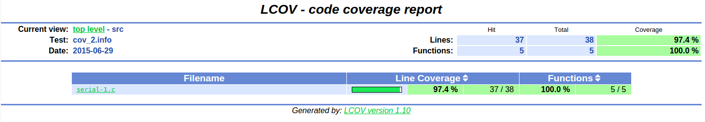

# METRICAS

Se muestran las metricas logradas por las implementaciones seriales:

* Covertura de codigo, con gcov y lcov
* Profiling, con gprof
* Memcheck, con valgrind leak-check
* Cachegrind, con valgrind cachegrind
* Callgrind, con valgrind callgrind

## Primera implementacion Serial

### Covertura de codigo

### Profiling

    Flat profile:

	Each sample counts as 0.01 seconds.
	  %   cumulative   self              self     total           
	 time   seconds   seconds    calls  ns/call  ns/call  name    
	 33.40      0.01     0.01   100000   100.20   100.20  encryptor_init_data
	 33.40      0.02     0.01   100000   100.20   200.40  init_decryptor
	 33.40      0.03     0.01                             main
	  0.00      0.03     0.00   100000     0.00     0.00  encryptor_final
	  0.00      0.03     0.00   100000     0.00     0.00  encryptor_init
	  0.00      0.03     0.00   100000     0.00     0.00  encryptor_set_input
	  0.00      0.03     0.00   100000     0.00     0.00  encryptor_set_iv
	  0.00      0.03     0.00   100000     0.00     0.00  encryptor_set_key
	  0.00      0.03     0.00   100000     0.00     0.00  encryptor_update
	  0.00      0.03     0.00   100000     0.00     0.00  keygen_itokey_v2
	  0.00      0.03     0.00        1     0.00     0.00  check_parameters
	  0.00      0.03     0.00        1     0.00     0.00  fs_read
	  0.00      0.03     0.00        1     0.00     0.00  keygen_getenv
	  0.00      0.03     0.00        1     0.00     0.00  print_result
	  0.00      0.03     0.00        1     0.00     0.00  read_parameters
	  
	  %         the percentage of the total running time of the
	time       program used by this function.

	cumulative a running sum of the number of seconds accounted
	 seconds   for by this function and those listed above it.

	 self      the number of seconds accounted for by this
	seconds    function alone.  This is the major sort for this
			   listing.

	calls      the number of times this function was invoked, if
			   this function is profiled, else blank.

	 self      the average number of milliseconds spent in this
	ms/call    function per call, if this function is profiled,
			   else blank.

	 total     the average number of milliseconds spent in this
	ms/call    function and its descendents per call, if this 
			   function is profiled, else blank.

	name       the name of the function.  This is the minor sort
			   for this listing. The index shows the location of
			   the function in the gprof listing. If the index is
			   in parenthesis it shows where it would appear in
			   the gprof listing if it were to be printed.
			   
### Memcheck

	==6444== Memcheck, a memory error detector
	==6444== Copyright (C) 2002-2013, and GNU GPL'd, by Julian Seward et al.
	==6444== Using Valgrind-3.10.0.SVN and LibVEX; rerun with -h for copyright info
	==6444== Command: bin/serial tmp/encryptedfile
	==6444== 
	==6444== 
	==6444== HEAP SUMMARY:
	==6444==     in use at exit: 217,400,928 bytes in 300,004 blocks
	==6444==   total heap usage: 300,004 allocs, 0 frees, 217,400,928 bytes allocated
	==6444== 
	==6444== 399,960 bytes in 49,995 blocks are definitely lost in loss record 16 of 23
	==6444==    at 0x4C2AB80: malloc (in /usr/lib/valgrind/vgpreload_memcheck-amd64-linux.so)
	==6444==    by 0x4C2CF1F: realloc (in /usr/lib/valgrind/vgpreload_memcheck-amd64-linux.so)
	==6444==    by 0x401668: encryptor_set_input (encryptor.c:51)
	==6444==    by 0x401A0F: init_decryptor (commons.c:30)
	==6444==    by 0x400F5A: main (serial.c:36)
	==6444== 
	==6444== 399,976 bytes in 49,997 blocks are definitely lost in loss record 17 of 23
	==6444==    at 0x4C2AB80: malloc (in /usr/lib/valgrind/vgpreload_memcheck-amd64-linux.so)
	==6444==    by 0x4C2CF1F: realloc (in /usr/lib/valgrind/vgpreload_memcheck-amd64-linux.so)
	==6444==    by 0x401668: encryptor_set_input (encryptor.c:51)
	==6444==    by 0x401A0F: init_decryptor (commons.c:30)
	==6444==    by 0x40104B: main (serial.c:51)
	==6444== 
	==6444== 799,840 bytes in 49,990 blocks are definitely lost in loss record 18 of 23
	==6444==    at 0x4C2AB80: malloc (in /usr/lib/valgrind/vgpreload_memcheck-amd64-linux.so)
	==6444==    by 0x4C2CF1F: realloc (in /usr/lib/valgrind/vgpreload_memcheck-amd64-linux.so)
	==6444==    by 0x401692: encryptor_set_input (encryptor.c:52)
	==6444==    by 0x401A0F: init_decryptor (commons.c:30)
	==6444==    by 0x40104B: main (serial.c:51)
	==6444== 
	==6444== 799,856 bytes in 49,991 blocks are definitely lost in loss record 19 of 23
	==6444==    at 0x4C2AB80: malloc (in /usr/lib/valgrind/vgpreload_memcheck-amd64-linux.so)
	==6444==    by 0x4C2CF1F: realloc (in /usr/lib/valgrind/vgpreload_memcheck-amd64-linux.so)
	==6444==    by 0x401692: encryptor_set_input (encryptor.c:52)
	==6444==    by 0x401A0F: init_decryptor (commons.c:30)
	==6444==    by 0x400F5A: main (serial.c:36)
	==6444== 
	==6444== 1,967,296 bytes in 472 blocks are possibly lost in loss record 20 of 23
	==6444==    at 0x4C2AB80: malloc (in /usr/lib/valgrind/vgpreload_memcheck-amd64-linux.so)
	==6444==    by 0x4E96D72: CRYPTO_malloc (in /lib/x86_64-linux-gnu/libcrypto.so.1.0.0)
	==6444==    by 0x4F224F0: EVP_CipherInit_ex (in /lib/x86_64-linux-gnu/libcrypto.so.1.0.0)
	==6444==    by 0x40184B: encryptor_init (encryptor.c:101)
	==6444==    by 0x400F7F: main (serial.c:38)
	==6444== 
	==6444== 11,243,292 (6,595,512 direct, 4,647,780 indirect) bytes in 49,966 blocks are definitely lost in loss record 22 of 23
	==6444==    at 0x4C2AB80: malloc (in /usr/lib/valgrind/vgpreload_memcheck-amd64-linux.so)
	==6444==    by 0x4E96D72: CRYPTO_malloc (in /lib/x86_64-linux-gnu/libcrypto.so.1.0.0)
	==6444==    by 0x4F224F0: EVP_CipherInit_ex (in /lib/x86_64-linux-gnu/libcrypto.so.1.0.0)
	==6444==    by 0x40184B: encryptor_init (encryptor.c:101)
	==6444==    by 0x40107D: main (serial.c:53)
	==6444== 
	==6444== 201,781,216 bytes in 48,412 blocks are definitely lost in loss record 23 of 23
	==6444==    at 0x4C2AB80: malloc (in /usr/lib/valgrind/vgpreload_memcheck-amd64-linux.so)
	==6444==    by 0x4E96D72: CRYPTO_malloc (in /lib/x86_64-linux-gnu/libcrypto.so.1.0.0)
	==6444==    by 0x4F224F0: EVP_CipherInit_ex (in /lib/x86_64-linux-gnu/libcrypto.so.1.0.0)
	==6444==    by 0x40184B: encryptor_init (encryptor.c:101)
	==6444==    by 0x400F7F: main (serial.c:38)
	==6444== 
	==6444== LEAK SUMMARY:
	==6444==    definitely lost: 210,776,360 bytes in 298,351 blocks
	==6444==    indirectly lost: 4,647,780 bytes in 1,166 blocks
	==6444==      possibly lost: 1,967,296 bytes in 472 blocks
	==6444==    still reachable: 9,492 bytes in 15 blocks
	==6444==         suppressed: 0 bytes in 0 blocks
	==6444== Reachable blocks (those to which a pointer was found) are not shown.
	==6444== To see them, rerun with: --leak-check=full --show-leak-kinds=all
	==6444== 
	==6444== For counts of detected and suppressed errors, rerun with: -v
	==6444== ERROR SUMMARY: 7 errors from 7 contexts (suppressed: 0 from 0)

### Cachegrind

	==6496== Cachegrind, a cache and branch-prediction profiler
	==6496== Copyright (C) 2002-2013, and GNU GPL'd, by Nicholas Nethercote et al.
	==6496== Using Valgrind-3.10.0.SVN and LibVEX; rerun with -h for copyright info
	==6496== Command: bin/serial tmp/encryptedfile
	==6496== 
	--6496-- warning: L3 cache found, using its data for the LL simulation.
	==6496== 
	==6496== I   refs:      6,538,286,552
	==6496== I1  misses:        4,114,297
	==6496== LLi misses:            1,471
	==6496== I1  miss rate:          0.06%
	==6496== LLi miss rate:          0.00%
	==6496== 
	==6496== D   refs:      2,722,155,801  (2,449,232,101 rd   + 272,923,700 wr)
	==6496== D1  misses:        3,512,982  (       21,989 rd   +   3,490,993 wr)
	==6496== LLd misses:        3,484,522  (        6,515 rd   +   3,478,007 wr)
	==6496== D1  miss rate:           0.1% (          0.0%     +         1.2%  )
	==6496== LLd miss rate:           0.1% (          0.0%     +         1.2%  )
	==6496== 
	==6496== LL refs:           7,627,279  (    4,136,286 rd   +   3,490,993 wr)
	==6496== LL misses:         3,485,993  (        7,986 rd   +   3,478,007 wr)
	==6496== LL miss rate:            0.0% (          0.0%     +         1.2%  )
	
### Callgrind

	==6550== Callgrind, a call-graph generating cache profiler
	==6550== Copyright (C) 2002-2013, and GNU GPL'd, by Josef Weidendorfer et al.
	==6550== Using Valgrind-3.10.0.SVN and LibVEX; rerun with -h for copyright info
	==6550== Command: bin/serial tmp/encryptedfile
	==6550== 
	==6550== For interactive control, run 'callgrind_control -h'.
	==6550== 
	==6550== Events    : Ir
	==6550== Collected : 6538286549
	==6550== 
	==6550== I   refs:      6,538,286,549

	--------------------------------------------------------------------------------
	Profile data file 'callgrind.out.6550' (creator: callgrind-3.10.0.SVN)
	--------------------------------------------------------------------------------
	I1 cache: 
	D1 cache: 
	LL cache: 
	Timerange: Basic block 0 - 241449799
	Trigger: Program termination
	Profiled target:  bin/serial tmp/encryptedfile (PID 6550, part 1)
	Events recorded:  Ir
	Events shown:     Ir
	Event sort order: Ir
	Thresholds:       99
	Include dirs:     
	User annotated:   
	Auto-annotation:  off

	--------------------------------------------------------------------------------
			   Ir 
	--------------------------------------------------------------------------------
	6,538,286,549  PROGRAM TOTALS

	--------------------------------------------------------------------------------
			   Ir  file:function
	--------------------------------------------------------------------------------
	5,861,250,000  ???:BF_encrypt [/lib/x86_64-linux-gnu/libcrypto.so.1.0.0]
	  312,200,000  ???:BF_set_key [/lib/x86_64-linux-gnu/libcrypto.so.1.0.0]
	   65,400,000  ???:CAST_set_key [/lib/x86_64-linux-gnu/libcrypto.so.1.0.0]
	   45,071,614  /build/buildd/eglibc-2.19/malloc/malloc.c:_int_malloc [/lib/x86_64-linux-gnu/libc-2.19.so]
	   27,900,083  /build/buildd/eglibc-2.19/stdio-common/vfprintf.c:vfprintf [/lib/x86_64-linux-gnu/libc-2.19.so]
	   13,800,000  ???:CAST_decrypt [/lib/x86_64-linux-gnu/libcrypto.so.1.0.0]
	   12,300,164  /build/buildd/eglibc-2.19/malloc/malloc.c:malloc [/lib/x86_64-linux-gnu/libc-2.19.so]
	   12,107,940  /build/buildd/eglibc-2.19/string/../sysdeps/x86_64/multiarch/memcpy-sse2-unaligned.S:__memcpy_sse2_unaligned [/lib/x86_64-linux-gnu/libc-2.19.so]
	   11,700,004  ???:EVP_CipherInit_ex [/lib/x86_64-linux-gnu/libcrypto.so.1.0.0]
	   11,250,000  ???:BF_decrypt [/lib/x86_64-linux-gnu/libcrypto.so.1.0.0]
	   10,489,032  /build/buildd/eglibc-2.19/libio/genops.c:_IO_default_xsputn [/lib/x86_64-linux-gnu/libc-2.19.so]
	   10,160,084  ???:CRYPTO_lock [/lib/x86_64-linux-gnu/libcrypto.so.1.0.0]
		7,250,000  ???:CAST_cbc_encrypt [/lib/x86_64-linux-gnu/libcrypto.so.1.0.0]
		7,250,000  ???:BF_cbc_encrypt [/lib/x86_64-linux-gnu/libcrypto.so.1.0.0]
		6,733,360  /build/buildd/eglibc-2.19/stdio-common/_itoa.c:_itoa_word [/lib/x86_64-linux-gnu/libc-2.19.so]
		5,777,071  ???:ERR_put_error [/lib/x86_64-linux-gnu/libcrypto.so.1.0.0]
		5,700,000  ???:EVP_DecryptUpdate [/lib/x86_64-linux-gnu/libcrypto.so.1.0.0]
		5,300,004  src/encryptor.c:encryptor_set_input [/home/dnoliver/Repositories/openssl-bruteforce-2/bin/serial]
		5,199,996  /build/buildd/eglibc-2.19/malloc/malloc.c:realloc [/lib/x86_64-linux-gnu/libc-2.19.so]
		4,800,012  src/encryptor.c:encryptor_init_data [/home/dnoliver/Repositories/openssl-bruteforce-2/bin/serial]
		4,681,567  ???:0x00000000000e57f0 [/lib/x86_64-linux-gnu/libcrypto.so.1.0.0]
		4,644,734  ???:EVP_DecryptFinal_ex [/lib/x86_64-linux-gnu/libcrypto.so.1.0.0]
		4,400,072  src/serial.c:main [/home/dnoliver/Repositories/openssl-bruteforce-2/bin/serial]
		4,400,000  /build/buildd/eglibc-2.19/libio/vsnprintf.c:vsnprintf [/lib/x86_64-linux-gnu/libc-2.19.so]
		4,391,751  /build/buildd/eglibc-2.19/string/../sysdeps/x86_64/multiarch/memcmp-sse4.S:__memcmp_sse4_1 [/lib/x86_64-linux-gnu/libc-2.19.so]
		4,100,012  src/keygen.c:keygen_itokey_v2 [/home/dnoliver/Repositories/openssl-bruteforce-2/bin/serial]
		4,000,020  /build/buildd/eglibc-2.19/string/../sysdeps/x86_64/strchr.S:strchrnul [/lib/x86_64-linux-gnu/libc-2.19.so]
		3,900,000  ???:EVP_CIPHER_CTX_init [/lib/x86_64-linux-gnu/libcrypto.so.1.0.0]
		
### Observaciones

#### Memcheck

* HEAP SUMMARY:
	* in use at exit: 217,400,928 bytes in 300,004 blocks
	* total heap usage: 300,004 allocs, 0 frees, 217,400,928 bytes allocated

* LEAK SUMMARY:
  * definitely lost: 210,776,360 bytes in 298,351 blocks
  * indirectly lost: 4,647,780 bytes in 1,166 blocks
  * possibly lost: 1,967,296 bytes in 472 blocks
  * still reachable: 9,492 bytes in 15 blocks

#### Callgrind

* Ir: 6,538,286,549  PROGRAM TOTALS

## Segunda implementacion Serial

### Covertura de codigo

### Profiling

	Flat profile:

	Each sample counts as 0.01 seconds.
	  %   cumulative   self              self     total           
	 time   seconds   seconds    calls  ms/call  ms/call  name    
	100.08      0.02     0.02   100000     0.00     0.00  gen_key
	  0.00      0.02     0.00        2     0.00    10.01  do_decrypt
	  0.00      0.02     0.00        1     0.00     0.00  fs_read
	  0.00      0.02     0.00        1     0.00     0.00  get_cant_keys

	 %         the percentage of the total running time of the
	time       program used by this function.

	cumulative a running sum of the number of seconds accounted
	 seconds   for by this function and those listed above it.

	 self      the number of seconds accounted for by this
	seconds    function alone.  This is the major sort for this
			   listing.

	calls      the number of times this function was invoked, if
			   this function is profiled, else blank.

	 self      the average number of milliseconds spent in this
	ms/call    function per call, if this function is profiled,
			   else blank.

	 total     the average number of milliseconds spent in this
	ms/call    function and its descendents per call, if this 
			   function is profiled, else blank.

	name       the name of the function.  This is the minor sort
			   for this listing. The index shows the location of
			   the function in the gprof listing. If the index is
			   in parenthesis it shows where it would appear in
			   the gprof listing if it were to be printed.

### Memcheck

	==7100== Memcheck, a memory error detector
	==7100== Copyright (C) 2002-2013, and GNU GPL'd, by Julian Seward et al.
	==7100== Using Valgrind-3.10.0.SVN and LibVEX; rerun with -h for copyright info
	==7100== Command: bin/serial-1 tmp/encryptedfile
	==7100== 
	==7100== 
	==7100== HEAP SUMMARY:
	==7100==     in use at exit: 0 bytes in 0 blocks
	==7100==   total heap usage: 2 allocs, 2 frees, 4,300 bytes allocated
	==7100== 
	==7100== All heap blocks were freed -- no leaks are possible
	==7100== 
	==7100== For counts of detected and suppressed errors, rerun with: -v
	==7100== ERROR SUMMARY: 0 errors from 0 contexts (suppressed: 0 from 0)

### Cachegrind

	==7130== Cachegrind, a cache and branch-prediction profiler
	==7130== Copyright (C) 2002-2013, and GNU GPL'd, by Nicholas Nethercote et al.
	==7130== Using Valgrind-3.10.0.SVN and LibVEX; rerun with -h for copyright info
	==7130== Command: bin/serial-1 tmp/encryptedfile
	==7130== 
	--7130-- warning: L3 cache found, using its data for the LL simulation.
	==7130== 
	==7130== I   refs:      6,326,475,380
	==7130== I1  misses:            1,101
	==7130== LLi misses:            1,071
	==7130== I1  miss rate:          0.00%
	==7130== LLi miss rate:          0.00%
	==7130== 
	==7130== D   refs:      2,628,653,548  (2,398,956,496 rd   + 229,697,052 wr)
	==7130== D1  misses:           10,477  (        7,141 rd   +       3,336 wr)
	==7130== LLd misses:            8,895  (        6,014 rd   +       2,881 wr)
	==7130== D1  miss rate:           0.0% (          0.0%     +         0.0%  )
	==7130== LLd miss rate:           0.0% (          0.0%     +         0.0%  )
	==7130== 
	==7130== LL refs:              11,578  (        8,242 rd   +       3,336 wr)
	==7130== LL misses:             9,966  (        7,085 rd   +       2,881 wr)
	==7130== LL miss rate:            0.0% (          0.0%     +         0.0%  )

### Callgrind

	==7185== Callgrind, a call-graph generating cache profiler
	==7185== Copyright (C) 2002-2013, and GNU GPL'd, by Josef Weidendorfer et al.
	==7185== Using Valgrind-3.10.0.SVN and LibVEX; rerun with -h for copyright info
	==7185== Command: bin/serial-1 tmp/encryptedfile
	==7185== 
	==7185== For interactive control, run 'callgrind_control -h'.
	==7185== 
	==7185== Events    : Ir
	==7185== Collected : 6326475377
	==7185== 
	==7185== I   refs:      6,326,475,377
	
	--------------------------------------------------------------------------------
	Profile data file 'callgrind.out.7185' (creator: callgrind-3.10.0.SVN)
	--------------------------------------------------------------------------------
	I1 cache: 
	D1 cache: 
	LL cache: 
	Timerange: Basic block 0 - 196578381
	Trigger: Program termination
	Profiled target:  bin/serial-1 tmp/encryptedfile (PID 7185, part 1)
	Events recorded:  Ir
	Events shown:     Ir
	Event sort order: Ir
	Thresholds:       99
	Include dirs:     
	User annotated:   
	Auto-annotation:  off

	--------------------------------------------------------------------------------
			   Ir 
	--------------------------------------------------------------------------------
	6,326,475,377  PROGRAM TOTALS

	--------------------------------------------------------------------------------
			   Ir  file:function
	--------------------------------------------------------------------------------
	5,861,250,000  ???:BF_encrypt [/lib/x86_64-linux-gnu/libcrypto.so.1.0.0]
	  312,200,000  ???:BF_set_key [/lib/x86_64-linux-gnu/libcrypto.so.1.0.0]
	   65,400,000  ???:CAST_set_key [/lib/x86_64-linux-gnu/libcrypto.so.1.0.0]
	   15,911,428  src/serial-1.c:gen_key [/home/dnoliver/Repositories/openssl-bruteforce-2/bin/serial-1]
	   13,800,000  ???:CAST_decrypt [/lib/x86_64-linux-gnu/libcrypto.so.1.0.0]

### Observaciones

#### Memcheck

* HEAP SUMMARY
  * in use at exit: 0 bytes in 0 blocks
  * total heap usage: 2 allocs, 2 frees, 4,300 bytes allocated
  * All heap blocks were freed -- no leaks are possible

#### Callgrind

* Ir: 6,326,475,377  PROGRAM TOTALS